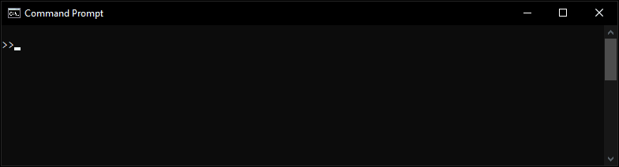

# Publish/Subscribe Messaging System

<a href="#"></a>

**Summary**  
This project implements a publish/subscribe messaging system using Java sockets, following a client-server architecture. Multiple clients can connect to a central server to interact as either publishers or subscribers. Publishers send messages to specific topics, while subscribers receive messages from the topics they are subscribed to. The server manages topics, clients, and ensures proper message flow with a focus on concurrency and synchronization.

**Objectives**

- **Client-Server Architecture**: Implement a server that handles multiple client connections using Java sockets.
- **Publish/Subscribe Model**: Facilitate dynamic topic creation, publication of messages, and topic subscriptions.
- **Topic Management**: Automatically create and manage topics based on client interactions.
- **Concurrency Handling**: Ensure the system operates correctly under concurrent client connections and interactions.
- **Server Administration**: Provide server-side commands for inspecting and managing topics and messages.

**Features**

- Clients can publish messages to topics or subscribe to receive updates from topics.
- Topics are dynamically created when clients publish to or subscribe to new topics.
- The server offers administrative commands for inspecting topics and messages, and even allows for message deletion.
- Threading and concurrency are efficiently managed to allow multiple clients to connect and interact with the system simultaneously.
- Synchronization mechanisms such as `synchronized` blocks, `wait/notifyAll`, and `CountDownLatch` are used to ensure safe access to shared resources by multiple clients, avoiding race conditions.
- The system uses Java's socket programming to facilitate client-server communication, ensuring robust message exchange over a network.
- The server controls prevent message loss or duplication during concurrent access, ensuring messages are delivered to the correct subscribers.

**Concurrency Programming Techniques**  
The system uses advanced concurrency programming techniques to handle multiple clients interacting concurrently. Each client has its own thread using the `ClientHandler` class. The `TopicManager` handles shared resources like topics and messages, with synchronization ensuring safe access. Techniques like `BlockingQueue` and `CountDownLatch` are used for thread communication and managing tasks. This ensures that all clients can publish, subscribe, and interact without conflicts or data inconsistencies.

**Code Structure**

- **Server**: Manages client connections, topics, and message flow between clients.
- **Client**: Clients connect to the server to either publish messages or subscribe to topics.
- **TopicManager**: Central component for managing topics and coordinating messages between publishers and subscribers.
- **ClientHandler**: Manages each client’s interaction with the server and processes requests.
- **Message**: Represents individual messages within a topic, including metadata like timestamps and publisher info.

**Usage Instructions**

1. **Project Structure**  
   The project is divided into two folders: `client` and `server`.

2. **Compilation**  
   Navigate to the appropriate folder (`client` or `server`) and use the following command to compile the Java files:

   ```bash
   javac *.java
   ```

3. **Starting the Server**  
   To start the server, run the following command from the `server` directory:

   ```bash
   java Server <port>
   ```

   Example:

   <a href="#"></a>

   ```bash
   java Server 9018
   ```

4. **Running the Client**  
   To run a client, execute the following command from the `client` directory:

   ```bash
   java Client <host> <port>
   ```

   Example:

   <a href="#"></a>

   ```bash
   java Client localhost 9018
   ```

5. **Client Commands**  
   Once connected, clients can issue the following commands:

   - `publish <topic>`: Publish messages to a specific topic.

     <a href="#"></a>

   - `subscribe <topic>`: Subscribe to a topic to receive updates.

     <a href="#"></a>

   - `show`: Request a list of available topics from the server.

     <a href="#"></a>

   - `quit`: Disconnect from the server.

6. **Commands as Publisher**  
   As a Publisher, clients can issue the following commands:

   - `send <message>`: After choosing a topic, publish a message to it.

     <a href="#"></a>

   - `list`: List messages you’ve published to a topic.

     <a href="#"></a>

   - `listall`: List all messages in a topic.

     <a href="#"></a>

   - `quit`: Disconnect from the server.

7. **Commands as Subscriber**  
   As a Subscriber, clients can issue the following commands:

   - `listall`: List all messages in a topic.

     <a href="#"></a>

   - `quit`: Disconnect from the server.

8. **Server Administration Commands**  
   The server accepts administrative commands directly from the console:

   - `show`: Displays all available topics.

     <a href="#"></a>

   - `inspect`: Inspect messages in a specific topic.

     <a href="#"></a>

   - `quit`: Shuts down the server gracefully.

9. **Inspection Commands**  
   During the inspection, the following commands can be issued from the console:

   - `:listall`: Displays all available messages in a specific topic.

     <a href="#"></a>

   - `:delete <id>`: Eliminates a specific message of a given id.

     <a href="#"></a>

   - `:end`: To end the interactive inspect on console.

<br>

---

This project is an implementation of a real-time messaging system using a client-server architecture via Java sockets. The publish/subscribe model is handled effectively, with a strong emphasis on concurrency control using synchronization techniques. The use of Java socket programming ensures robust communication between clients and the server. The design handles concurrent client interactions with efficiency, ensuring that the messaging system scales well with multiple users.
